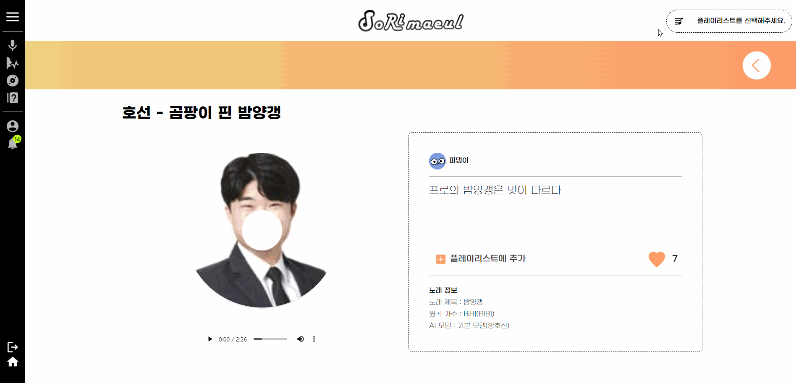
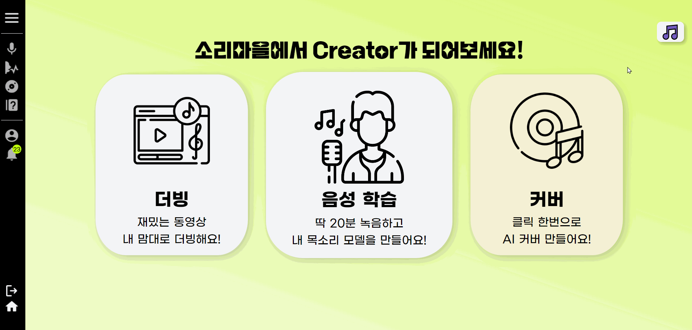

# 🎤 소리마을

서비스를 간략하게 소개할 수 있는 말

 

# 목차

1. [개요](#🏕-개요)
2. [서비스 및 기능 소개](#🕹-서비스-및-기능-소개)
3. [개발 환경](#🛠-개발-환경)
4. [설계 문서](#📄-설계-문서)
5. [팀원 소개](#👨‍👨‍👧👨‍👧‍👦-팀원-소개)

  

# 🏕 개요

> **💻프로젝트 기간** : 2024.02.26 (월) ~ 2024.04.04 (목)   **서비스 URI** : [소리마을](https://j10e201.p.ssafy.io)   **참고 영상** : [UCC](https://www.youtube.com/shorts/1t7Adam0-y0)

  

## 기획의도(@@@수정 필요@@@)

AI 트랜드 소개, AI 음성 시장, 콘텐츠 문화(AI 커버 채널 구독자 수, 조회수, 영상 컨텐츠) ⇒ 재미

  

# 🕹 서비스 및 기능 소개

## 서비스 화면

### 랜딩 페이지 + 메인 페이지
|  |  |
| :---------------------: | :--------------------: |
| **Landing Page** | **Main Page** |
| 소셜 로그인을 지원합니다. | 서비스에 대한 간략한 소개 페이지 |

  

### 음성 모델 학습 페이지
|  |  |
| :-----------------------------: | :------------------------------: |
| **Step 1 & Step 2** | **Step 3-1** |
| 이름과 썸네일을 입력합니다. | 스크립트를 읽어가며 직접 녹음하여 학습할 수 있습니다. |
|  |  |
| **Step 3-2** | **Step 3-3** |
| 녹음 파일을 직접 업로드하여 학습할 수 있습니다.|만들어진 모델을 업로드할 수 있습니다.|

  

### 더빙 극장
|  |  |
| :-----------------------------: | :------------------------------: |
| **컨텐츠 조회** | **원본 영상 조회 & 게시글 조회** |
|상단의 'Hot Contents' 또는 하단의 컨텐츠 리스트를 통해 더빙할 수 있는 컨텐츠를 조회할 수 있습니다.|원본 영상 및 다른 사람이 올린 더빙 게시글을 조회할 수 있습니다.|
|  |  |
| **더빙하기** | **녹음하기** |
| 제목을 입력 후 더빙을 할 수 있습니다. |영상에 맞춰 녹음할 수 있습니다. 녹음된 음성을 들어볼 수 있으며, 마음에 들지 않는다면 다시 녹음할 수 있습니다. |
|  |  |
| **변환하기** | **더빙 생성** |
| 녹음된 음성을 원하는 음성 모델로 변환할 수 있습니다. 변환된 음성을 들어볼 수 있으며, 마음에 들지 않는다면 다른 모델, 다른 피치로 다시 변환할 수 있습니다.|더빙 영상을 생성합니다. 따로 녹음을 하지 않은 등장인물은 기본 음성으로 저장됩니다.|

  

### AI 커버
|   |  |
| :----------------: | :----------------: |
| **게시글 조회** | **AI 커버 생성** |
| 'Hot Contents'와 다른 사용자가 올린 AI 커버 게시글을 조회할 수 있습니다. | 직접 Youtube 링크를 올리거나 사이트에서 제공하는 곡을 선택하여 음성 모델 목소리로 변환할 수 있습니다. |

  

### 플레이리스트
|  |  |
| :----------------: | :----------------: |
| **플레이리스트 생성하기** | **플레이리스트 곡 추가하기** |
|마이페이지에서 플레이리스트를 생성합니다.|생성된 플레이리스트에 공개 설정된 곡을 추가할 수 있습니다.|
|  |  |
| **재생할 플레이리스트 선택** | **플레이리스트 재생** |
| 재생을 원하는 플레이리스트를 선택 |플레이리스트에 담겨있는 곡들을 재생합니다. |

  

### 마이페이지
|  |  |
| :----------------: | :----------------: |
| **나의 음성 모델** | **나의 더빙 컨텐츠** |
|미완성 모델을 이어서 학습하거나 완성된 모델을 조회, 삭제할 수 있습니다.|나의 더빙 컨텐츠를 조회, 공개/비공개 설정, 삭제할 수 있습니다.|
|  |  |
| **나의 AI 커버** | **나의 관심 컨텐츠** |
|나의 AI 커버를 조회, 공개/비공개 설정, 삭제할 수 있습니다.|내가 좋아요 누른 게시글들을 조회할 수 있습니다.|
|  |
| **나의 플레이리스트** |
|나의 플레이리스트를 생성, 조회할 수 있고 플레이리스트에 들어있는 AI 커버를 재생해볼 수 있습니다.|

  

### 문의 게시판 + 알림
|  |  |
| :----------------: | :----------------: |
| **문의 게시판** | **알림** |
|FAQ를 조회할 수 있고, 더빙 컨텐츠 추가, AI 커버 기본 제공곡 추가 등 필요한 사항을 요청할 수 있습니다.|모델 및 컨텐츠 제작 완료, 실패에 대한 알림을 받을 수 있습니다.|

  

# 🛠 개발 환경
### ⚙ Management Tool
> 형상 관리 : Gitlab  
> 이슈 관리 : Jira  
> 커뮤니케이션 : Mattermost, Notion, KakaoTalk  
> 디자인 : Figma

 

### 💻 IDE
> Visual Studio Code 1.85.1   
> IntelliJ 11.0.19

 

### 🛢 Back-End

> IntelliJ IDEA 2023.3.2 (Community Edition)  
> Java 17 (Azul Zulu version 17.0.9)  
> Spring boot 3.2.2  
> MySQL 8.0.36

 

### 📱 Front-End
> React 18.2.0  
> Redux 5.0.1  
> Tailwind CSS 3.4.1  
> Node.js 20.10.0

 

### 👨‍💻 AI
> Python 3.9.13  
> CUDA Toolkit 11.7.1  
> Anaconda 4.10.3 

 

### 🌐 Server
> - Ubuntu 20.04.6 LTS
> - AWS S3 Bucket
> - Jenkins 2.443
>   - Nginx 1.18.0
>   - OpenSSL 1.1.1f
> - GPU server
>   - Ubuntu 20.04.4 LTS
>   - Device: NVIDIA Corporation GV100GL (Tesla V100 PCle 32GB)  

  

# ⛺ 아키텍처

  

# 📄 설계 문서
## 요구사항 정의서

  

## 기능 정의서

  

## Swagger

  

## API 명세서

  

## ERD

  

# 👨‍👨‍👧👨‍👧‍👦 팀원 소개
팀원 소개(@@이미지추가필요@@)